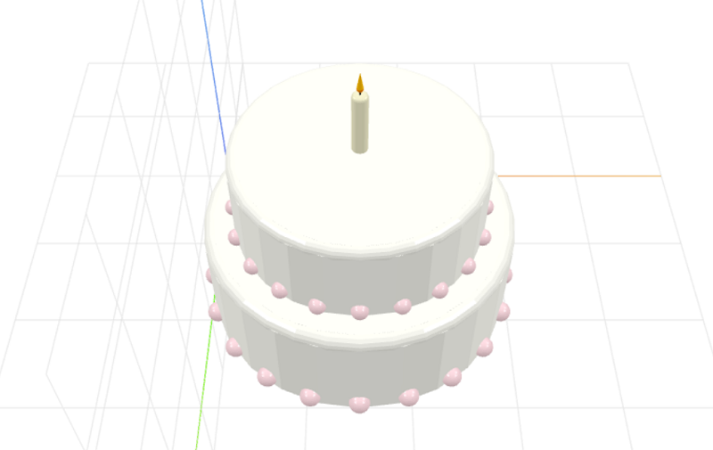

# craft-weddingcake

Parameterized cake model.

### Usage
```html
<craft>
    <craft name="cake" module="craft-weddingcake"/>
    <cake></cake>
</cake>
```
 
### Parameters
- width: adjusts width of cake base
- height: adjusts height of cake base
- tiers: adjusts number of cake layers
- beadNumber: adjusts number of decorative beads

### Example
```html
<craft>
    <craft name="cake" module="craft-weddingcake"/>
    <craft name="candle" module="craft-candle"/>
    <row spacing="1">
        <cake width="25" height="1"/></cake>
        <stack>
            <candle height="20" width="5" t="scale(0.3,0.3,0.3)"></candle>
            <cake></cake>
        </stack>
    </row>
</craft>
```


